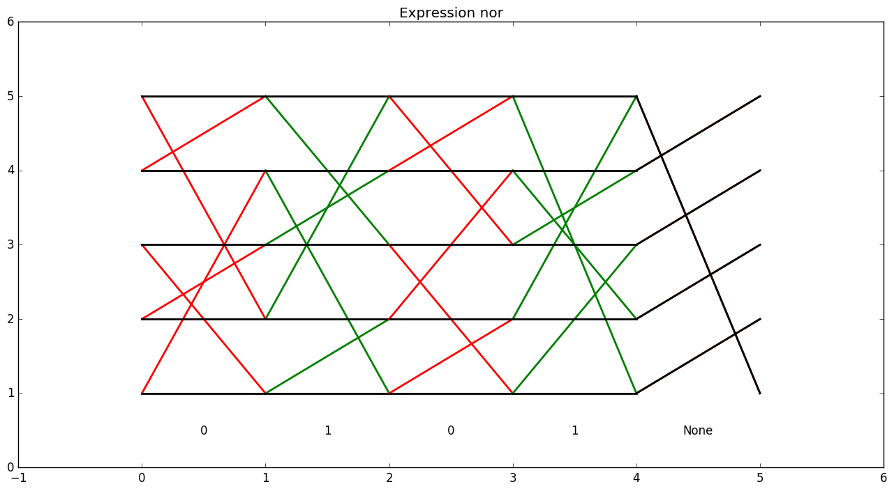

# More examples

## `and`: `a & b`

As noted in the README, this diagram clearly shows how the commutator is used.
## `and_not`: `a & ~b`

## `nand`: `~(a & b)`

This is an example of a circuit where all inputs being 0 results in the output being 1. This means that the black line starting on the bottom left must end up at the second row, so we have to add at least one instruction which affects the black (variable false) lines. It would be possible to merge the `None` instruction into the one before it, but it could look confusing.

## `or`: `a | b`

## `or_not`: `a | ~b`

## `nor`: `~(a | b)`

(see comments on `nand`)

## `xor`: `(~a & b) | (a & ~b)`

## `xnor`: `~((~a & b) | (a & ~b))`

## `xor_opt`: `(~a & b) | (~b & a)`

Initially I thought that the length-16 program shown above was the shortest possible for `xor`. However, note that the program generated has the variable structure

    a b a b a b a b a b a b a b a b
    ---1--- ---2--- ---3--- ---4---

where the ordering of groups 2 and 4 come from the fact that `a` comes before `b` in the subexpression `a & ~b`. However, `~b & a` is an equivalent expression, and the program it generates has variable ordering

    a b a[b b]a[b{a a}b]a[b b]a b a
    ---1--- ---2--- ---3--- ---4---

where the instruction pair in braces reduces to the identity element, and the instruction pairs in brackets can be reduced to single instructions. The resulting program has length 11. Interestingly, here the optimizer generated an instruction that is not a 5-cycle (the 3-cycle at instruction 8).
## `xnor_opt`: `~((~a & b) | (~b & a))`

(see comments on `xor_opt`)

## `and3`: `(a & b) & c`

## `and4`: `(a & b) & (c & d)`

## `and4_unbalanced`: `((a & b) & c) & d`

As noted in the README, "unbalanced" chains of conjunctions and disjunctions, which increase the depth of the expression, cause the resulting program to be much longer.

## `or3`: `(a | b) | c`

## `or4`: `(a | b) | (c | d)`

## `or4_unbalanced`: `((a | b) | c) | d`

(see comments on `and4_unbalanced`)

## `redundant_a`: `(a | a) & (a | a)` (no deduplication)

This is the result of turning off the deduplication optimization. Since there are only two possibilities (`a` is true or `a` is false), most of the red lines are unnecessary.
## `just_a`: `a`

A trivial diagram. This is also the result of leaving deduplication on for the previous example.

## `and_or_and_not`: `(a & b) | (c & ~d)`

An example of an expression with many variables and many inputs which output 1.
