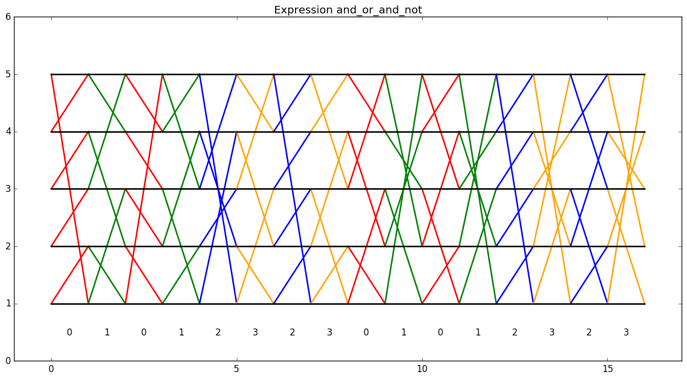

# fivecycle
Visualizing Barrington's theorem

We describe a proof of Barrington's theorem that allows for a straightforward computer implementation, and give visualizations of the resulting constructions.

## Sneak peak

Start on the bottom-left corner, and move right, while:
1. taking none of the colored lines
2. taking just the red lines
3. taking just the green lines
4. taking both red and green lines

You should find that you ended up at the bottom in all cases except the last, where you moved up to the second row.

If you just want to see pretty pictures, [jump to the examples section](#examples).

## Background

I encountered this surprising statement a few months (years?) ago.

> If every second or so your computer's memory were wiped completely clean, except for the input data; the clock; a static, unchanging program; and a counter that could only be set to 1, 2, 3, 4, or 5, it would still be possible (given enough time) to carry out an arbitrarily long computation - just as if the memory weren't being wiped clean each second. This is almost certainly not true if the counter could only be set to 1, 2, 3, or 4. The reason 5 is special here is pretty much the same reason it's special in Galois' proof of the unsolvability of the quintic equation.

(#4 from [Logicians on safari](https://www.scottaaronson.com/blog/?p=152), Scott Aaronson)

At first it seems impossible to do this, since each "timestep", the program can only send one of five numbers (1, 2, 3, 4, or 5) to the next timestep. It seems like the program must somehow use this number to represent all of the previous computation; however, intuitively it seems that some programs will need to use a significant amount of memory, much more than can fit in selecting one of five options (or log2(5) bits). For example, to compute the most common bit in a length-64 bitstring, one might expect to need 64 states just to count the bits.

In fact, it is always possible to perform the computation (for certain constraints on the type of computation). This result is known as Barrington's theorem ([Barrington 1989](https://people.cs.umass.edu/~barring/publications/bwbp.pdf)).

## Solution

We present a solution here similar to the original proof given by Barrington. We do not assume too much knowledge of theoretical computer science terms.

### Formalization

#### Boolean circuits

First, we need to formalize the types of computations described in the statement. We consider an arbitrary boolean expression, which is an expression made up of:
* literals `x_0, x_1, ...` (or some other letters)
* negations `~p` ("not")
* conjunctions `p & q` ("and")
* disjunctions `p | q` ("or")

For example, `x_0 | (x_1 & ~x_2)` evaluates to true when `x_0` is true, or `x_1` is true and `x_2` is false; it evaluates to false otherwise. Our goal is to compute this boolean expression using the setup described above. Note that this means the size of the input is fixed, however this can (theoretically!) perform "useful" computations, such as computing the value of a cryptographic hash function one bit at a time, or encrypting data using a block cipher like AES, all while only storing a number from 1 to 5 in memory. (The "theoretically" is very important; as we will see later the program produced is impractical to actually use!) Note that any boolean function can be written as a boolean expression. As a naive upper bound, just create a truth table of your function, create subexpressions which are true for a given combination of inputs, and `or` them together.

#### Branching programs

Now we formalize the idea of "wiping" the computer's memory every second. This is represented by *branching programs*. A branching program is a list of instructions, where each instruction is of the form `<j, f, g>`. A branching program keeps an internal state `s`, and runs through its instructions sequentially. For a given instruction `<j, f, g>`, the program looks at the `j`th input bit `x_j`. If `x_j` is 1, the program replaces `s` with `f(s)`, otherwise, it replaces `s` with `g(s)`. Then the program continues on the next instruction. A branching program which maps the set `{1, 2, ... w}` to itself is called a width-w branching program (w-BP). A w-BP where all of the `f` and `g` are permutations is called a width-w permutation branching program (w-PBP). We will focus on 5-PBPs, where the state corresponds to the counter.

Note that 5-PBPs can be directly translated to the original setup. For each timestep, find the instruction `<j, f, g>` to run using the clock, look at the `j`th input bit, and apply the corresponding function to the counter. The only information which needs to be sent to the next timestep is the counter.

As an example, consider the 3-PBP

    <0, (1 -> 2, 2 -> 1), ()>
    <1, (), (1 -> 2, 2 -> 3, 3 -> 1)>

If neither `x_0` nor `x_1` are true, the program maps 1 to 2, 2 to 3, and 3 to 1. If `x_0` is true but `x_1` is false, the program maps 1 to 3 and 3 to 1 (leaving 2 alone). If `x_0` is false but `x_1` is true, the program never changes the state. If both `x_0` and `x_1` are true, the program maps 1 to 2 and 2 to 1 (leaving 3 alone).

#### Cycle notation, composition, identity, and inverses

To make the rest of this page easier to read, we introduce cycle notation for permutations. The expression

    (a b c ... e)

represents the function that maps `a` to `b`, `b` to `c`, ..., and `e` to `a`. For example, `(1 2 3 4 5)` represents the permutation that "rotates" the numbers from 1 to 5 up by 1.

Additionally, given two permutations `p_1` and `p_2`, the expression

    p_1 p_2

represents the function taking `x` to `p_2(p_1(x))`; i.e. applying `p_1`, then `p_2`.

(Not all permutations can be written as a single cycle - you might need multiple such as `(1 -> 2, 2 -> 1, 3 -> 4, 4 -> 3) = (1 2)(3 4)` - but the ones we care about can.)

The identity permutation, denoted `id`, will represent the permutation which doesn't affect any of the elements. For example, for any permutation `p`, `p id = id p = p`.

Finally, we define the inverse of a permutation `p` (denoted `p^-1`) to be the permutation which "undoes" the effect of `p`. In other words, `p p^-1 = id`. In cycle notation, the inverse of `p` is just the "flipped" version of `p`, for example `(1 2 4 3)^-1 = (3 4 2 1) = (1 3 4 2)`.

As an example, the program from above can now be written as

    <0, (1 2), id>
    <1, id, (1 2 3)>

### Converting boolean expressions to 5-PBPs

For a 5-PBP `M`, we say `M` `p`-computes the expression `E` if `M` applies the permutation `p` to the state when `E` is true, and otherwise does not affect the state (i.e. applies `id`). For example, the following program:

    <0, (1 2), id>
    <1, (1 2), id>

`(1 2)`-computes the expression `x_0 xor x_1`. (Well, we don't actually have xor, so we'll say it `(1 2)`-computes the expression `(x_0 & ~x_1) | (~x_0 & x_1)` which is equivalent.)

Now we consider the expression we wish to convert. First, as preprocessing, convert all subexpressions of the form `A | B` into the equivalent expression `~(~A & ~B)`. The resulting expression only has literals, negations, and conjunctions.

Now we will define a recursive function `ToPBP(E, p)` which converts an expression `E` into a 5-PBP which `p`-computes `E`, given that `p` is a cycle of length 5.

`ToPBP(x_i, p)` (where `x_i` is a literal) returns

    <i, p, id>

This step is straightforward. `p` is applied when `x_i` is true, otherwise the state is left unchanged.

`ToPBP(~A, p)` (where `A` is a subexpression) returns

    ToPBP(A, p^-1)
    <*, p, p>

where `*` can be any index. This is because if `A` is true, `ToPBP(A, p^-1)` applies `p`, which is then undone, resulting in `id` overall; if `A` is false, `ToPBP(A, p^-1)` does not affect the state, then `p` is applied, resulting in `p` overall. Note that as long as `ToPBP(A, p^-1)` is nonempty, the last line can be "multiplied in" to the last instruction of `ToPBP(A, p^-1)`, by composing both of its cases by `p` on the right.

For `ToPBP(A & B, p)` (where `A` and `B` are subexpressions), first write `p` as the cycle `(s_1 s_2 s_3 s_4 s_5)` (possible by assumption). Then, let `x = (s_1 s_3 s_2 s_5 s_4)`, and `y = (s_1 s_2 s_4 s_5 s_3)`. Finally, return

    ToPBP(A, x)
    ToPBP(B, y)
    ToPBP(A, x^-1)
    ToPBP(B, y^-1)

This is the clever portion of the proof. One can check that `x y x^-1 y^-1 = p`, so if both `A` and `B` are true the program applies `p`. However if either one is false, the remaining permutations cancel each other out, and the state is left unchanged. (In general, this pattern is called a commutator.)

This part of the proof relies on the fact that we are using 5-PBPs. It is not possible to write a cycle `p` of length 4 in the form `x y x^-1 y^-1` where `x` and `y` are cycles of length 4 (all such products are either length-3 cycles or the identity), and likewise for length 3 and 2 (all such products are the identity).

### Using our 5-PBP to solve the problem

Finally, given any boolean expression `E`, call `ToPBP(E, (1 2 3 4 5))` to get a 5-PBP `M` which `(1 2 3 4 5)`-computes `E`. Back in the memory-wiping setup, we first initialize the counter to `1`, then run each instruction of `M` as described in the section "Branching programs". At the end, if the counter is 2, `M` must have applied `(1 2 3 4 5)` so `E` was true; if the counter is 1, `M` must have left the state unchanged, so `E` was false.

### Size

One can check by induction that for an expression of depth `d`, `ToPBP` will result in a program with at most `4^d` instructions (assuming we perform the optimization mentioned in the `not` case). Similarly, `ToPBP` will result in a program with at least `3*2^d - 2` instructions (though further "optimizing" structures like those produced from `a & ~a` can reduce this). Thus, the 5-PBPs produced will be very large.

Due to this, when generating diagrams for chains of conjunctions or disjunctions, it is better to reduce the depth, using expressions like `(a & b) & (c & d)` instead of `((a & b) & c) & d` which is the same as `a & b & c & d`.

### Is this necessary?

Actually, for simple circuits, we don't need a very large program. For example, this 2-PBP `(1 2)`-computes `x_0 xor x_1 xor x_2 xor x_3`:

    <0, (1 2), id>
    <1, (1 2), id>
    <2, (1 2), id>
    <3, (1 2), id>

Similarly, this 2-BP (not PBP!) computes `x_0 | x_1 | ~x_2 | ~x_3`:

    <0, (1 -> 2), ()>
    <1, (1 -> 2), ()>
    <2, (), (1 -> 2)>
    <3, (), (1 -> 2)>

(where starting at 1, the result is 2 if the expression is true and 1 otherwise.)

However, the inductive proof makes sure a 5-PBP exists for all possible expressions.

### Technical notes

Actually, the original proof differs slightly from this write-up in a few places.
* The original proof deals with boolean circuits, rather than expressions. However, it is straightforward to convert a circuit to an expression, and the depth does not change in the conversion.
* The original proof looks at circuits of logarithmic depth (circuits in NC1). This was to show that circuits in NC1 can be converted to polynomial-size 5-PBPs, since `4^O(log n)` is polynomial in `n`.
* We shy away from generality of the group-theoretic terms here. Note that for a 5-PBP, each `f` and `g` are actually elements of S5, and other terms (identity, inverse) are taken directly from group theory. Additionally, the existence of length-5 cycles which multiply to make another length-5 cycle is related to the fact that S5 is not solvable.
* We compose permutations left-to-right as this is what the original paper does. Some people may be more familiar with right-to-left composition.

## Visualization

We can visualize a permutation by drawing two rows/columns of corresponding points (here, columns) representing the elements of the set, and connecting the elements in the first column to the elements they get mapped to in the second column. Composition then just becomes connecting two such diagrams. We can generalize this a bit and overlay two such diagrams to represent the two permutations in a 5-PBP instruction.

This will be much more clear with an example :)

To use this diagram, first assign truth-values to each variable (red/`x_0` and green/`x_1`). Starting at the left side of the bottom row, for each permutation, if the corresponding variable is true, take the colored line; else, take the black line. If the expression evaluated to true, you will have ended up on the second row at the end; if the expression evaluated to false, you will have stayed on the first row.

Since our diagrams `(1 2 3 4 5)`-compute expressions, you can actually start on any row, and if the expression is true, you will move up one row (wrapping around to the bottom row).

Finally, note that if an instruction has two general permutations (as in the last instruction here), the resulting diagram can get confusing. We can "pull" all the black (variable false) lines to the horizontal, to make the permutations easier to follow, as long as we adjust the colored (variable true) lines accordingly. This means that we can reduce the process of following the permutation to taking only the colored lines whose corresponding variables are true.

If you haven't noticed yet, both of these diagrams represent the expression `x_0 | x_1`.

## Examples

Here, `a` refers to `x_0`, `b` to `x_1`, etc.

### `and`: `a & b`

This diagram clearly shows the use of the commutator - note how the two red permutations are mirrors of each other, as are the two green permutations. However, putting them together results in the permutation `(1 2 3 4 5)`.

### `and_or_and_not`: `(a & b) | (c & ~d)`

This diagram is an example of a nontrivial expression where there are several inputs that output 1. Also, this expression is not monotone (taking only `c` outputs 1, but taking `c` and `d` outputs 0).

### `xor`: `(~a & b) | (a & ~b)`

This diagram shows a complex program using only two variables. Taking only red or only green results in the second row, but taking both results in the first row again. Like the previous example, this circuit is not monotone.

The page [EXAMPLES.md](EXAMPLES.md) contains many more examples.

## Usage

The point of this project was not to implement a parser, so this program can't be used as a command-line program or utility. Instead, you can play around using `python -i demo.py`, which imports the functions and defines some helper variables.

    $ python -i demo.py
    >>> demo(a | b) # generates the diagram and displays it
    >>> demo(a | b, show=False) # don't display the plot
    >>> demo((a & ~a) | b, dedup=False) # disable deduplication
    >>> demo((a & ~a) | b, clean=False) # disable cleaning
    >>> demo((a & ~a) | b, dedup=False, clean=False) # both - very messy

Or, you can directly look at the generated programs:

    >>> demo(a | b, prog=True)
    <0, (02143), id>
    <1, (04132), id>
    <0, (04213), id>
    <1, (03241), id>
    >>> demo(a | b, prog=True, clean=False)
    <0, id, (03412)>
    <1, id, (04213)>
    <0, id, (02143)>
    <1, (01234), (04132)>

## License

Licensed under GPLv3. See the LICENSE file for details.

Copyright (c) Andrew Li 2018
